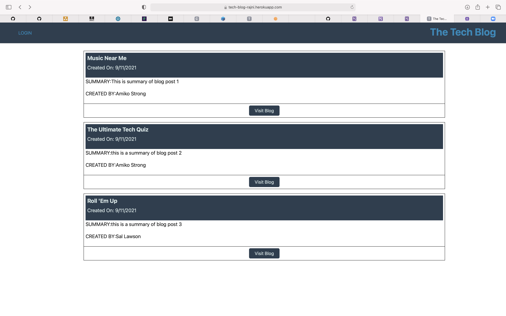
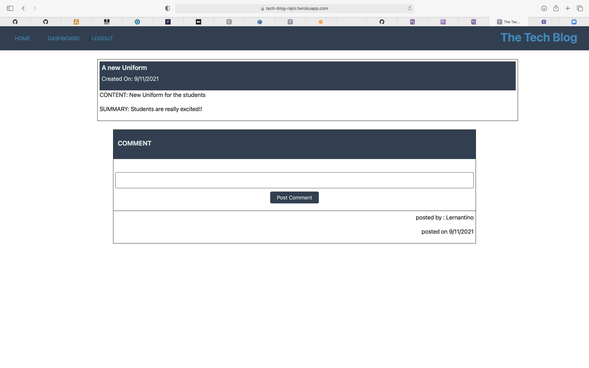
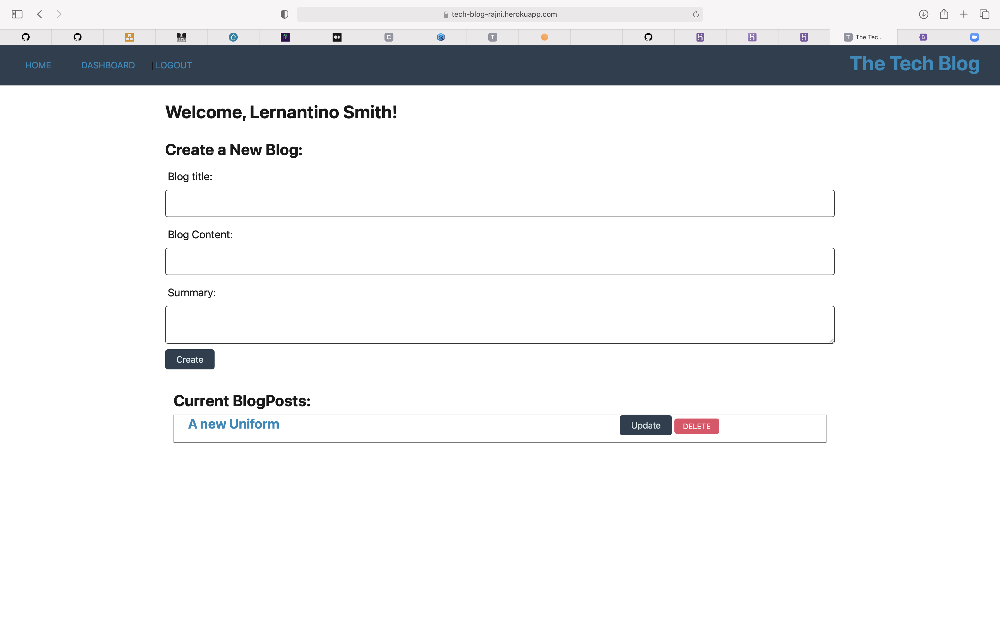

# The_Tech_Blog

A CMS-style blog site similar to a Wordpress site, where developers can publish their blog posts and comment on other developers’ posts as well.


## Table of contents

- [Description](#Description)
- [Heroku Deployed Link](#DeployedApp)
- [Installation](#Installations)
- [Usage](#Usage)
- [Testing](#Testing)
- [Contributing](#Contributing)
- [Questions](#Questions)
- [License](#License)

## Description

```md
GIVEN a CMS-style blog site
WHEN I visit the site for the first time
THEN I am presented with the homepage, which includes existing blog posts if any have been posted; navigation links for the homepage and the dashboard; and the option to log in
WHEN I click on the homepage option
THEN I am taken to the homepage
WHEN I choose to sign up
THEN I am prompted to create a first name,last name,email and password
WHEN I click on the sign-up button
THEN my user credentials are saved and I am logged into the site
WHEN I revisit the site at a later time and choose to sign in
THEN I am prompted to enter my username and password
WHEN I am signed in to the site
THEN I see navigation links for the homepage, the dashboard, and the option to log out
WHEN I click on the homepage option in the navigation
THEN I am taken to the homepage and presented with existing blog posts that include the post title and the date created
WHEN I click on an visit blog button on the existing blog post
THEN I am presented with the post title, contents,summary, post creator’s username, and date created for that post and have the option to leave a comment
WHEN I enter a comment and click on the submit button while signed in
THEN the comment is saved and the post is updated to display the comment, the comment creator’s username, and the date created
WHEN I click on the dashboard option in the navigation
THEN I am taken to the dashboard and presented with any blog posts I have already created and the option to add a new blog post,also update or delete any existing blogpost
WHEN I create a new blog post
THEN the title, contents and summary of my post are saved.
When I click on the update blog button
Then I am presented with editable text box for title ,content and summary.
WHEN I click on the logout option in the navigation
THEN I am signed out of the site
```

## DeployedApp

https://tech-blog-rajni.herokuapp.com

## Screenshots





## Usage

Create, Delete and Update blog posts using the heroku link provided in the README.

## Installations

```md
npm install
npm install sequelize
npm init -y
npm install express --save
npm install dotenv
npm install mysql2
npm install express-handlebars
npm install bcrypt
npm install express-session
npm install connect-session-sequelize
npm i eslint eslint-config-prettier eslint-plugin-prettier prettier --save-dev
In Package.json add (under script)"lint": "npx eslint \*_/_.js --quiet; exit 0"
```

## Routes

```md
get route for login(homeRoutes.js)
http://localhost:3001/login

get route to view complete profile of logged in(homeRoutes.js)
http://localhost:3001/Profile

post route for logging in(UserRoutes.js)
http://localhost:3001/api/users/login
Body(JSON)
{
"email": "lernantino@gmail.com",
"password": "password12345"
}

post route for new user (userRoutes.js)
http://localhost:3001/api/users/
Bosy(JSON)
{
"fname":"new",
"lname":"user1",
"email": "newuser@gmail.com",
"password": "password12345"
}

get request for all blogpost(homeRoutes.js)
http://localhost:3001/

get request for a single blogpost (homeRoutes.js)
http://localhost:3001/Blogpost/2
('2' is the blogpost id)

post request for blogpost (blogPostRoutes.js)
http://localhost:3001/api/blogpost
BODY(JSON)
{
"title": "The Ultimate Tech Quiz",
"content": "A web app that will give users 10 new technical questions each day and track their progress in things like programming, cybersecurity, database architecture, and more!"

}

put request for blogpost(blogPostRoutes.js)
http://localhost:3001/api/blogpost/:id

delete request for blogpost(blogPostRoutes.js)
http://localhost:3001/api/blogpost/:id

post request for postcomment (blogPostRoutes.js)
http://localhost:3001/api/blogpost/:post_id/postcomment
BODY(JSON)
{

"content": "This is the first comment on the post"
}

delete request for postcomment(postCommentRoutes.js)
http://localhost:3001/api/comments/:id
```

## Testing

Test the login,logout,create,update delete and post comments options

## Contributing

Rajni Dua

## Questions

For any further questions, reachout to me at :

- Github: [rajnidua](https://github.com/rajnidua)
- Email: rajni.dua14@gmail.com

## License


&copy; 2021 Rajni Dua

_Licensed under [MIT](./license)_
